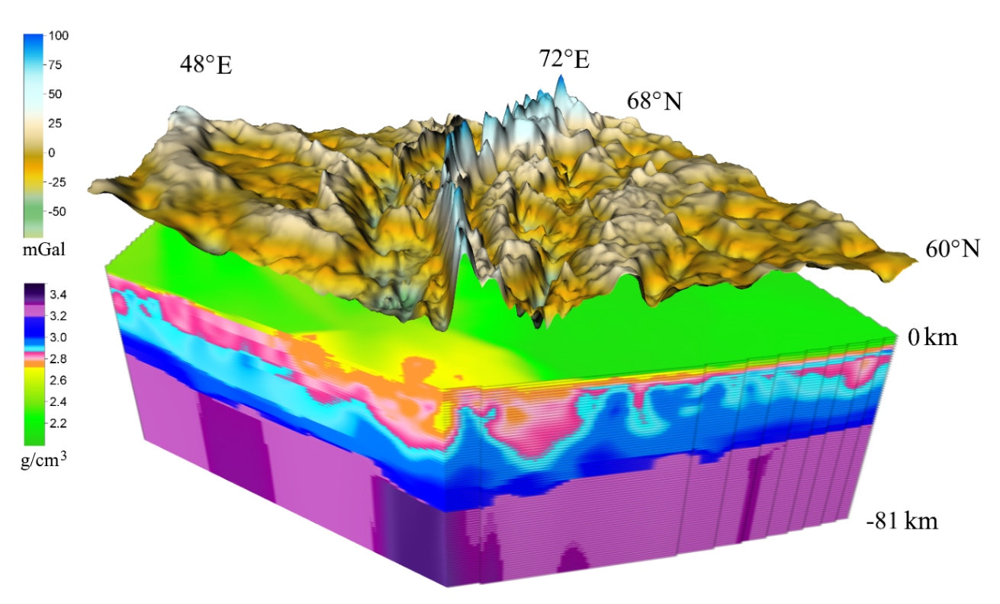

# GRAFEN v0.1 - GRAvity Field Ellipsoidal density model Numerical computations for CUDA-enabled distributed systems

## Description

 A performance-effective program for gravity field* calculation for layered ellipsoidal density model. The program can calculate gravity filed in arbitrary points outside the density model. Input density model discretization is assumed to be regular in Gauss-Kruger (aka Transverse Mercator) projection (thus, irregular in geodetic coordinates).

The program is intended to work on distributed systems with CUDA accelerators.

*normal derivative of gravity potential


## Dependencies
You will need these only if you want to build the program yourself. If you just want to run the binaries, see [*How to run the example*](#how-to-run-the-example) section below.

- Visual Studio 2017+ (Community version will do, select "Release" Configuration before building)
- [CUDA 10.1](https://developer.nvidia.com/cuda-downloads)
- [MS MPI](https://github.com/Microsoft/Microsoft-MPI)
- [GeographicLib 1.49](https://sourceforge.net/projects/geographiclib/)
- [Boost 1.71.0](https://www.boost.org/users/history/version_1_71_0.html)

The program primarily designed to work with Surfer (© Golden Software) [Grid File Format](http://voxlerhelp.goldensoftware.com/voxler.htm#t=File_Formats%2FSurfer_7_Grid_File_Format.htm)

For now we're only targeting Windows systems, but the source code itself is not Windows-dependent, you can try to recompile it for Linux.

## Hardware requirements

- Nvidia GPU with CUDA compute capability 3.5 or higher (any modern 2015+ Nvidia GPU will do)
- At least 2GB GPU memory to run the example

## Program arguments
Specify file for the output field:

`-dat2D dat2DfiledExample.dat`		- XYV file, where V is the gravity filed value (in [milligals](https://en.wikipedia.org/wiki/Gal_(unit))). XY - arbitrary points in Gauss-Kruger projection (km). V is ignored as input. See example `example/timan.dat`

or

`-dat3D dat3DfiledExample.dat`		- XYZV file, where V is the gravity filed value. XY - arbitrary points in Gauss-Kruger projection (km). Z and V are ignored as input. Z will be set to H (see bellow).

or

`-grd7 grdField.grd`			- Surfer grd7 file. Grid dimensions are used as file input. All coordinates in Gauss-Kruger projection (km). Old grid values are ignored and will be rewritten.

Specify input parameters:
`-Hf 0.00001`						- Height over the Ellipsoid on which the field is being calculated (km). This parameter is ignored if `-dat3D` was specified. It is not recommended to pass exactly 0.
`-dens dens_model`			- Directory with layered density model (set of grd7 files)

`-Hfrom -81` 				- Depth of the lower grid layer (density model)

`-Hto 0` 					- Depth of the upper grid layer (density model)

`-Hn 81` 					- Number of layers of the density model (must be same as amount of files in dens_model)

`-l0 57` 					- Central meridian for Gauss-Kruger projection

`-DPR 180` 				-(optional) Radius of point-field replacement (in km). If you don't specify this option, replacement radius will be automatically deduced, based on condition that the output field accuracy won't be reduced more than by 0.1%.

`-toRel`					- (optional) Convert input density model to relative values

`-noInvFileOrder`			- (optional) Don't invert the file order of density model

`-transposeSolver`		- (optional) Solve gravity problem with transposed forward gravity field operator. Files in dens_model will be rewritten, "output field" is now treated as input.


## How to run the example

1. Install [MS MPI](https://www.microsoft.com/en-us/download/details.aspx?id=57467)
2. Go to `exapmle/`.
3. Put `cudart64_101.dll`, `grafen_cu101.exe` and uncompressed folder with model `resmodel_timan/` here (all files are in *releases*).
4. Fix `hosts.txt`. You need to put here hosts that will execute the program. First host is 'root' host - it does not do actual computations. All other hosts perform computations using one GPU per host. You can utilize several GPUs on a single host by putting the same host entry several times in the file.
For example, if you have 2 GPUs on host 192.168.5.1 and 4 GPUs on host 192.168.5.2. Your `host.txt` should be as follows:
```
192.168.5.1
192.168.5.1
192.168.5.1
192.168.5.2
192.168.5.2
192.168.5.2
192.168.5.2
```
Note, that the first host has one extra entry compared to the amount of its GPUs.
**If you have one GPU on the same machine you're running the program on, you can leave default `hosts.txt` without changes.**

5. Fix path to `mpiexec` in `mpirun.cmd` if needed. Change `C:\` in `C:\%cd:~3%` to your network drive (e.g. `\\MYHOST\SHARED_FOLDER\`) or, if you're running the program locally, change it to your drive letter.
6. Run `timan.bat`. After the program is done you will have calculated field in `timan.dat`.

## Running on multiple nodes

1. Make sure you have NFS between the nodes (the files of the program and the data should be available via the same path).
2. Make sure you have  `smpd` running on all hosts under the same user.
3. Make sure your firewall doesn't interfere with MPI connections. 

## Citation

If you're using our program in your work, please, reference this repo and one of our papers:

1. [*Martyshko P.S., Ladovskii I.V., Byzov D.D., Chernoskutov A.I.* On Solving the Forward Problem of Gravimetry in Curvilinear and Cartesian Coordinates: Krasovskii's Ellipsoid and Plane Modeling // Izvestiya-physics of the solid earth, Volume: 54, Issue: 4, 565-573. DOI: 10.1134/S1069351318040079](https://link.springer.com/article/10.1134/S1069351318040079)

2. [*Martyshko P.S., Byzov D.D., Chernoskutov A.I.* Accounting for the influence of the Earth’s sphericity in three-dimensional density modelling. Doklady Earth Sciences, 477(1), 1325-1329 DOI: 10.1134/S1028334X17110150](http://link.springer.com/article/10.1134/S1028334X17110150)

`resmodel_timan` in *releases* is a real solution of gravity filed inversion problem for a part of Timan-Pechora platform (Russia). The methodology of acquiring such a result is described in the next paper (please reference it if you're going to use the model in your work):

3. [*Martyshko P.S., Ladovskii I.V., Byzov D.D., Tsidaev A.G.* Gravity Data Inversion with Method of Local Corrections for Finite Elements Models // Geosciences. 2018. Vol. 8. Issue 10. № 373. DOI: 10.3390/geosciences8100373](https://www.mdpi.com/2076-3263/8/10/373)

## License

This software is distributed under MIT License. © Alexander Chernoskutov, Denis Byzov

The files of `resmodel_timan`  are distributed under MIT License. © Bulashevich Institute of Geophysics, Ural Branch of the Russian Academy of Sciences, Yekaterinburg, Russia

## Acknowledgements

Development of this software was supported by the Russian Foundation for Basic Research (project no. 17-05-00916_a). 

